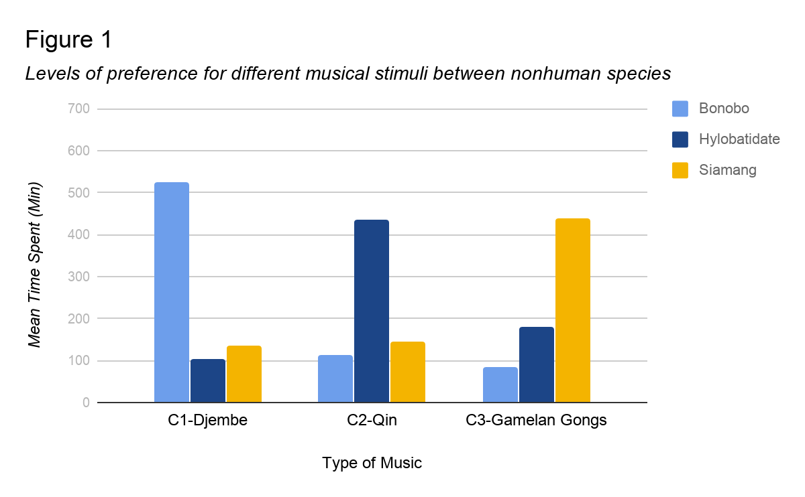

<!--
Reading copy of the August 2019 PSY310 final paper.
The wording is the 2019 text. It is not a revision.
The original file is 2019-08-psy310-final-paper.docx.
-->

# Environmental Influence on the Forming of Musical Preference in Nonhuman Primate
*Ryuichi Hamakawa*
*State University of New York at Stony Brook*

## Abstract
Past work from similar study fields such as psychology and neuroscience has reported that human music can bring human-like emotional reaction to nonhuman species. However, more detailed study on the forming process of musical preference of nonhuman species could barely be found today. The presented study was a cross-sectional experimental study on the effect of the environmental influence on musical preference in nonhuman primates. A two way analysis of variance of the main effects of three different breeds of nonhuman primate and three different musical stimuli on the musical preference in nonhuman primates was done. The preference for musical stimuli was measured by observing the mean response time of each subject primate group to each musical stimuli. The results showed significant main effect of both breed type and stimuli type on the mean response time to each musical stimuli. The results of the presented study suggested further possibility of interacting with other nonhuman species via musical techniques, which contributes to fields such as psychological study, animal study, and music study.

## Introduction
Human beings have flourished their culture and community over centuries, and one of its greatest achievement is the development of music. Human flourished their first musical activity in Africa (Price, 2013). Through time, human beings invented different ways of creating sound and composing, and eventually different purpose for music. However, human beings are not alone when it comes to enjoying music (Novak & Suomi, 1988). While it is no question that animals do enjoy music as well as human beings, what about musical preference? Do other species share same musical preference forming process with human beings? If so, where does that universal influence for our musical preference come from? The answer will bring us not only one but countless possibilities of better relationships between human beings and other species.

Thanks to the development of technologies and all the great scholars who opened the door of the field, studies on how music affects living things had been gradually conducted over the last decade. A former study has suggested that the forming of music preference in mammals is strongly affected by the surrounding environment (Mingle et al., 2014). This study also suggested that acoustic world music is very effective for stimulus designing since it is preferred over other non-acoustic sounds by monkeys. In addition, it is not simply where the music is from that makes the different reaction in the subjects but more detailed level, the component of the sound. Evidence showed that* Campbell’s monkeys* prefer consonant sound over dissonant sounds (Koda et al., 2013). Mingle et al.(2014) also reported that nonhuman primates prefer acoustic sound over the non-acoustic sound. However, some studies reported different results with different nonhuman primate groups, and that the stimulus (music) was not designed properly. Some nonhuman primates detect fewer components and some others detect more (Honing, Merchant, Haden, Prado & Bartolo, 2012). Hinds and Purcell (2007) have shown that the change of physical status within different primates may vary depending on the ecology of the subject and its childhood experience, such as growing up in a noisy environment would cause different preference for sound loudness (Kosa et al.). Thus, the influence from the environment can be significant in the matter of both musical preference and the physical reaction. Different nonhuman primates will have different biological reaction to music such as heart rate, mean blood pressure and body temperature (Hinds and Purcell, 2007).

Human culture has a strong connection with where they live, and instruments also differentiate their features by the environment in a way such as wooden material differs by location. Living in the same environment, similar social animals such as primates should be able to receive the same influence on their musical preference forming process. The mechanism of the musical preference forming in nonhuman species can bring us the possibility of improving our way of interacting with other species in fields such as animal medication and animal music composing. A better understanding of what human and other species have in common is another way of knowing ourselves. With former studies as mentioned above supporting the fact that the environment can affect not only the musical preference of human beings but that of other species as well, former studies have suggested that nonhuman primates are able to detect musical components and have musical preferences (Mingle et al., 2014). It is now the time to find out the process of forming musical preference and how it is affected by the surrounding environment for human beings and nonhuman species.

The present study was designed and operated in order to explain how environmental matters can affect the forming of musical preference of nonhuman primates. Specifically, three groups of primates (5 sex random adults) from three different locations. With respect to the selection of subject and locations, three groups of hominoid primates,* Bonobo* from Africa,* Hylobatidae*** from India and China area, and* Siamang* from Malaysia and Sumatra area were recruited in order to have an effective difference between the domestic world music from each region. The number was limited to the minimum under consideration of tension between each single subject (too many subjects would cause DVs such as a fight). A former behavioral study on nonhuman primate society by Clutton-Brock & Huchard (2013), reported that larger number of male primates in a community group had higher tensions between male individuals. Two variables, what type of music (stimulus) and what type of the environment (environmental influence) were measured, and the measured outcome was the subject's most preferred stimulus. Subjects were expected to show the highest mean response time to the music stimulus from the same origins.

## Method
### Participants
Participants included 15 hominoid nonhuman primates (six males, nine females) in total, all of them were healthy native adult individuals. All the subject primates were recruited from habitats of each breed (Africa, China, and Sumatra). Subjects were separated into three groups of five, and each group was consisted of five individuals (two males, three females) from three different breeds;* Bonobo*from Africa,* Hylobatidae*from India and China area, and* Siamang*from Sumatra area. The number of the subjects and the sex ratio of each breed group were fixed due to consideration of tension between male subjects (Clutton-Brock & Huchard, 2013). Samuels and Henrickson (1988) also reported that group housing where primates are able to perform highly complex social interactions can cause serious fights. The mean age was 12.1 (*SD*= 2.2), and potential subjects were excluded prior to the study if they were pregnant, deaf, or cognitively impaired. These three breeds were chosen for its habitats since three different locations bring three different styles of world music, which was important for stimulus designing. Proper food and care such as entertaining items were given during the study.

### Materials
In order to measure the environmental influence on the forming of music preference in nonhuman primates, the time spent on different location and behaviors of the subjects, which were the two dependent variables to be measured, was measured with video recordings. The study room was designed to be an environment where subjects can spend time without distraction with replication of natural environments such as dirt floor, outdoor temperature, and sunlight as the only light source (Novak & Suomi, 1988). The amount of time spent on different locations and their behaviors were recorded by hidden cameras which were built in walls. Hidden cameras were chosen under consideration of keeping the artificial materials in the study room minimal; although proper food and care were given during the study, interactions between researchers and the subjects were also controlled to minimal. The study room was live streamed from hidden cameras to the researcher’s monitoring screen. Research team used three timers (to two decimal places) to measure the total minutes spent in each area. According to a former study, sleeping or napping seen among mammalian animals can be related to a mentally relaxed status (Miyazaki, Liu & Hayashi, 2017). Thus, behavioral measurement for presented study was designed to confirm any actions such as sleeping or napping during the session. Confirmation of sleeping or napping was collected by the monitoring of subjects.

The three different stimuli were played constantly from three equally distanced corners at the same time, from one hour after the sunrise until the sunset. The volume of the stimulus was set to loud enough for primates to hear from at least six meters away with a maximal sound intensity level of 45* dB*** and a minimal sound intensity level of 35* dB*** (maximal at closest to the speaker and minimal at approximately six meters away from the speaker). As former studies have shown that the sound components of the stimulus strongly influence the result. There were some general preferences for sounds among primates such as acoustic sound is preferred over non-acoustic sound (Mingle et al., 2014). The stimuli were designed to be acoustic, and this condition was met by clarifying what instrument to be used for each stimulus (one instrument for one stimulus). The instruments for each breed's habitat regions were Djembe, the most popular African drum of thousands worldwide (Price, 2013), Qin, a traditional Chinese string instrument with long history (Waltham, Yang Lan, & Koster., 2016), and Gamelan Gongs, a traditional Javanese music gongs which were originally supposed to be played in a traditional Javanese orchestra. Each of these instruments as part of its body made of natural materials, which influences the tone of the sound of the instrument greatly.

All three different stimuli shared the same control on their components, which were intensity and tone. Sound components, defined as intensity (*dB*), pitch (*Hz*), and tone, were controlled to have effective and minimal differences between the three stimuli. With consideration of results from former studies, the stimulus was designed to be a relatively soft sound (40*dB*) with white noise applied in order to diminish the unnecessary differences in tones. The softer sound was chosen because lower intensity is preferred over higher intensity (90*dB*<), and the white noise was applied since overly varied tones could become extraneous variables (Koda et al., 2013). With two out of three sound components controlled, pitch remained untouched since pitch changes were needed to structure melody lines. Each stimulus was designed and recorded by volunteer musicologists and musicians from the Department of Music at Stony Brook University.

### Procedure
Following an initial meeting for each primate to get used to other individuals from the same breed groups, each breed group was transported to the study location, Stony Brook University facility. First, subjects were assigned to spend approximately twelve hours (one hour before sunrise to one hour after sunset) in the study room in turn. Subjects were allowed to spend their time freely in the study room. Behaviors were recorded without any emergencies such as serious fights and other fatal matters. Proper food care and entertainment items were provided. Then, each breed group was exposed to three different stimuli from three equally distanced corners with speakers built in each. Supported by a former study report, Great apes universally build nests in which to sleep at night and sometimes during the day (Fruth, Tagg, and Stewart., 2018). The recording of each breed group continued until one hour after the sunset, which was the about time for primates to find a comfortable place and sleep. The recording stopped one hour after the sunset, and each subject primate were given back to the providers.

## Results
### Descriptive Statistics
The breed of the nonhuman primate subjects (IV1) and the type of music stimuli (IV2) were measured. The mean age of the subjects was 11.2 years old (*SD*=1.26). The conducted study indicated that all of the subjects from each breed group were able to finish the study, detect all three stimuli, and take short naps. The study showed that each breed group spent most of their time, which includes their short napping time, in where the stimulus which shares the same origin was played. At corner 1(C1), where the Djembe stimulus was being played, Bonobo group(*M*=524,* SD*=5.07) showed the preference and spent the most of their time there (See Figure 1 and Table 1 for full information). As well as the Hylobatidae group, Siamang group(*M*=135,* SD*=1.34) spent less time at C1. Sleep or napping activity at this location was only confirmed with Bonobo group. Next, Bonobo group(*M*=113,* SD*=3.22) spent less time than other two breed groups at C2 where Qin stimulus was given. Hylobatidae group(*M*=437,* SD*=1.89) on the other hand spent most of their time at this location. Siamang group(*M*=146,* SD*=5.74) spent relatively less time at this location, yet showed interest. Sleep or napping activities were seen only in the Hylobatidae group. At the C3, where Gamelan Gongs stimulus was given, Bonobo group(*M*=113,* SD*=3.40) showed their least interest and spent less time. Hylobatidae group(*M*=181,* SD*=5.76)spent more time at C3 than Bonobo group but no the most out of three. Siamang group(*M*=439,* SD*=5.03) spent their most time here, and also more than the other two groups.

*Figure 1. Levels of preference for different musical stimuli between nonhuman species.*

### Inferential Statistic
A two-way between-subjects analysis of variance (two-way ANOVA) was used to check for the main effect on the musical preference of nonhuman primates. The main effect of interest in the presented study were the possible effect of the stimuli and the breed types on the musical preference in nonhuman primates. There was a significant main effect of the stimuli,* F*(2,12)*=**x.xx**, P<.xx*., such that each primate group reacted differently to each stimulus.

The significance of the main effect of breed type was also confirmed,* F*(2,12)=*x.xx**, p<.xx.,* such that each primates group prefered music from each of their own origin over music from other regions. A significant interaction effect such that primates reacted differently depending on the type of stimuli and the breed type,* F(**x,x*)=*x.xx*,* p<.*

## Table 1

*Mean response time of each breed group on each stimulus location (minutes).*

| Stimulus | Bonobo | Hylobatidae | Siamang |
| --- | --- | --- | --- |
| C1 — Djembe | 524 | 102 | 135 |
| C2 — Qin | 113 | 437 | 146 |
| C3 — Gamelan Gongs | 83 | 181 | 439 |

## Discussion
The purpose of this study was to test how environmental influence can affect the forming of musical preference in nonhuman primates. I hypothesized that nonhuman primates would prefer musical stimuli from their own geographic due to the environmental influence in the musical stimulus. In other words, I expected the confirmation of environmental influence on traits such as musical preference in nonhuman social animals from the presented study. Specifically, subject primates were expected to spend most of their time in where the matched musical stimulus was played. In the presented study, each breed group showed a significant preference to the matched musical stimulus. Thus, with the significance of the presented study result, the hypothesis was supported by the presented study. Future studies on other social animal groups and more data are required to better support the hypothesis.

Through reviewing study reports of similar fields of study from the past decade, I found that few studies were done with detailed stimulus designing. With a huge amount of research done on the stimulus designing, the presented study has provided an effective cross-sectional experimental study that is valuable not only to the field of psychological science but fields such as music and culture study. The stimulus designing based on acoustic world music was effective, and the result was consistent with those of Mingle et al. (2014), which suggested that world acoustic music was preferred over other non-acoustic sounds. The stimulus designing of the presented study also focused on other basic components of a sound. Through controlling each component, the designed stimuli were not only acoustic world music but also provided the specific degree of each component. The presented study indicated that sounds with its loudness between 35*dB* to 45*dB* were effective possibly because it was about the same loudness of sounds in nature such as forests and plains. Although whether the stimulus was consonant or dissonant was not measured, relaxed status was confirmed in every breed group. Thus, primates were confirmed to accept the stimulus without disliking it. The study report by Koda et al. (2013), which indicated that dissonant sounds were disliked, while the subject preferred consonant sounds and silence more, might have lacked actual musical experience. A simple sound stimulus, which had been used in former studies, has difficulties to bring musical experience to the subject. In other words, one of the improvements of the presented study was being able to design stimuli which provided actual musical experience to the subjects rather than simply testing consonant or dissonant.

The presented study was a cross-sectional experimental study with animal subjects involved. The experiment was well designed and supported for its musical stimulus and the extraneous variable(EV) controlled experiment environment. One supportive strength of the presented study was that the stimuli were designed to be more than just a sound but an actual musical experience, while with its sound components controlled to prevent EVs. Including the stimulus mentioned above, the experiment environment was specially made to minimize the possibility of unwanted EVs and to maximize the significance of the expected result. Pre-study EV prediction included EVs such as visual effect of artificial objects in the environment and aggression between males caused from unbalanced sex ratio within the study group. Although an outdoor wild-field study would always be the perfect study environment, the specially designed experiment environment would be the second strength of the presented study.

The stimuli and environment supported the presented study result, yet there were limitations such as animal subject policy matters and unpreventable EVs. In order to find out more detailed brain activity of the subject, further study of animal experiment ethical policies was required. The understanding of what can be done to animal subjects and what is not is important for better study environment designing. Another limitation of the presented study was the lack of basic personality information of each primate such as the preference of food. For example, a primate subject would feel uncomfortable if the food given during the session were specifically something the subject disliked. This limitation could cause possible flaws for unwanted EVs such as specific dislike of the stimulus.

The presented study was definitely time-consuming and also required a massive amount of research in order for designing effective stimuli, experiment environment, and subject recruitment list. The results of the study were significant and fascinating, in a sense of bringing a new possibility to several academic fields such as behavior study, music study, and animal study. The more common traits in musical activity and perception in human and nonhuman species means more than understanding them. Although it is just the beginning of the journey, the presented study has shown paths to several new fields of study such as animal treatment and music science. Possible further research questions can also be supported by the presented study result. For instance, would animals from a similar environment prefer similar musical experiences? Do we share musical preferences with other species from local? Do contemporary music also have environmental influences? Finding out more about how other species on the planet perceive sounds and its relationship to that of humans, music will be an even more meaningful thing to humankind.

## References
Clutton‐Brock, T. H., & Huchard, E. ( 2013).  Social competition and selection in males and females.* Philosophical Transactions of the Royal Society B: Biological Sciences*,368, 20130074–20130074.

Fruth, B. B. I. F. ac. u., Tagg, N., & Stewart, F. (2018). Sleep and nesting behavior in primates: A review.* American Journal of Physical Anthropology*,* 166*(3), 499–509

Hand, R. (2018). Schools and families as institutions of learning in Central Javanese gamelan.* Ethnomusicology Forum*,* 27*(1), 68–87

Hinds, S. B., Raimond, S., & Purcell, B. K. (2007). The effect of harp music on heart rate, mean blood pressure, respiratory rate, and body temperature in the African green monkey.* Journal of Medical Primatology*,* 36*(2), 95–100.

Honing, H., Merchant, H., Háden, G. P., Prado, L., & Bartolo, R. (2012). Rhesus Monkeys (Macaca mulatta) Detect Rhythmic Groups in Music, but Not the Beat. PLoS ONE,* 7*(12), 1–10.

Koda, H., Basile, M., Olivier, M., Remeuf, K., Nagumo, S., Blois-Heulin, C., & Lemasson, A. (2013). Validation of an auditory sensory reinforcement paradigm: Campbell’s monkeys (Cercopithecus campbelli) do not prefer consonant over dissonant sounds.*Journal** of Comparative Psychology*,* 127*(3), 265–271.

Mingle, M. E., Eppley, T. M., Campbell, M. W., Hall, K., Horner, V., & de Waal, F. B. M. (2014). Chimpanzees prefer African and Indian music over silence.* Journal of Experimental Psychology: Animal Learning and Cognition*,* 40(*4), 502–505.

Novak, M. A., & Suomi, S. J. (1988). Psychological well-being of primates in captivity.* American Psychologist*,* 43*(10), 765–773.

PRICE, T. Y. . (2013). Rhythms of Culture: Djembe and African Memory in African-American Cultural Traditions.* Black Music Research Journal*,* 33*(2), 227–247

Samuels, A., & Henrickson, R. V. (1983). Outbreak of severe aggression in captive Macaca mulatta.* American Journal of Primatology*,* 5*(3), 277–281.

Waltham, C., Yang Lan, & Koster, E. (2016). An acoustical study of the qin.* Journal of the Acoustical Society of America*,* 139*(4), 1592–1600
